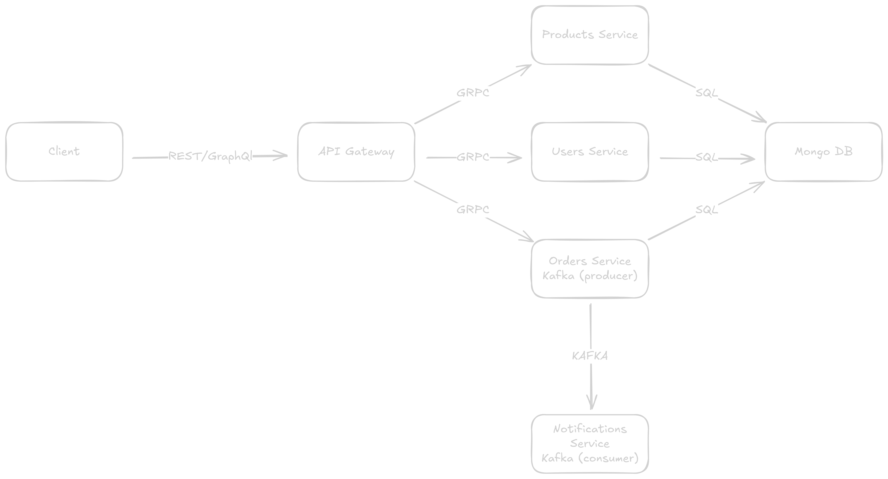

# Microservices E-commerce Platform

A minimalist e-commerce platform using Node.js microservices with different communication protocols:

- Product Service (gRPC)
- User Service (gRPC)
- Order Service (gRPC + Kafka event publishing)
- Notification Service (Kafka consumer)
- API Gateway (REST + GraphQL interfaces)
- MongoDB Database (shared database with separate collections)

## Architecture



## Prerequisites

- Node.js (v14+)
- npm or yarn
- Docker and Docker Compose

## Setup Instructions

1. Clone the repository
2. Install dependencies:

   ```bash
   npm install
   cd product-service && npm install
   cd user-service && npm install
   cd order-service && npm install
   cd notification-service && npm install
   cd api-gateway && npm install
   ```

3. Set up environment variables:

   Copy the `.env.example` file to `.env` and update the values:

   ```bash
   cp .env.example .env
   ```

   Then edit `.env` and configure:
   - MongoDB credentials (if different from defaults)
   - Email configuration for the notification service (EMAIL_USER, EMAIL_PASS, RECEIVER_EMAIL)
   - Any other service-specific configurations

## Running with Docker

The easiest way to run all services is using Docker Compose:

```bash
docker-compose --env-file .env up
```

Or if you prefer to use the default values from `.env.example`:

```bash
docker-compose up
```

This will build and start all services with healthchecks:

- **API Gateway**: http://localhost:3000 (healthcheck: `/health`)
- **Notification Service**: (internal Kafka consumer)
- **Order Service**: (internal gRPC server on port 3003)
- **User Service**: (internal gRPC server on port 3004)
- **Product Service**: (internal gRPC server on port 3005)
- **Kafka**: (internal on port 9092)
- **Zookeeper**: (internal on port 2181)
- **MongoDB**: (internal on port 27017)

All services include healthchecks and will wait for dependencies to be healthy before starting.

To rebuild the services after making changes:

```bash
docker-compose --env-file .env up --build
```

To stop all services:

```bash
docker-compose down
```

To view service health status:

```bash
docker-compose ps
```

## Running Services Locally

### Production Mode

Start all services:

```bash
npm run start:all
```

Or start individual services:

```bash
npm run start:product
npm run start:user
npm run start:order
npm run start:notification
npm run start:gateway
```

### Development Mode

Start all services with hot-reload:

```bash
npm run dev:all
```

Or start individual services in development mode:

```bash
npm run dev:product
npm run dev:user
npm run dev:order
npm run dev:notification
npm run dev:gateway
```

## Communication Patterns

This project demonstrates different communication patterns between microservices:

1. **gRPC** - All services (Product, User, Order) implement gRPC servers and are consumed by the API Gateway via gRPC clients
2. **REST API** - API Gateway exposes REST endpoints that internally call the gRPC services
3. **GraphQL** - API Gateway also provides a GraphQL interface for accessing the same services
4. **Event-Driven** - Order Service publishes events to Kafka, consumed by the Notification Service

## API Gateway Access

You can interact with all three main services (Product, User, and Order) through the API Gateway using either:

1. **REST API Endpoints**:

   - Products: `GET/POST /products`, `GET /products/:id`
   - Users: `GET/POST /users`, `GET /users/:id`
   - Orders: `GET/POST /orders`, `GET /orders/:id`

2. **GraphQL Interface**:
   - Access via `/graphql` endpoint on the API Gateway
   - Query products, users, and orders
   - Perform mutations for creating products, users, and orders

The API Gateway translates these REST and GraphQL requests into gRPC calls to the appropriate microservice.

## Service Details

- **Product Service**: Manages product catalog (name, price, inventory) using MongoDB
- **User Service**: Manages user accounts using MongoDB
- **Order Service**: Handles order creation, stores in MongoDB, and triggers notifications via Kafka
- **Notification Service**: Consumes Kafka events from the Order Service and sends email notifications
- **API Gateway**: Unified entry point that provides both REST and GraphQL interfaces
- **MongoDB Database**: Shared database with separate collections for products, users, and orders

## Network Configuration

The project uses Docker networks to isolate and secure communication between services:

- api-product-network: Connects API Gateway with Product Service
- api-user-network: Connects API Gateway with User Service
- api-order-network: Connects API Gateway with Order Service
- kafka-network: Connects Order Service with Kafka and Notification Service
- mongodb-user-network: Connects User Service with MongoDB
- mongodb-product-network: Connects Product Service with MongoDB
- mongodb-order-network: Connects Order Service with MongoDB

## API Testing with Bruno

This project includes API collections for [Bruno](https://www.usebruno.com/), an open-source API client that can be used to test all the services:

1. Install Bruno from https://www.usebruno.com/downloads
2. Open Bruno and select "Open Collection"
3. Navigate to the Bruno directory in this project
4. Use the provided requests to test each service:
   - Product Service: Access via REST and GraphQL through the API Gateway
   - User Service: Access via REST and GraphQL through the API Gateway
   - Order Service: Access via REST and GraphQL through the API Gateway
   - Examples for all available endpoints and queries
